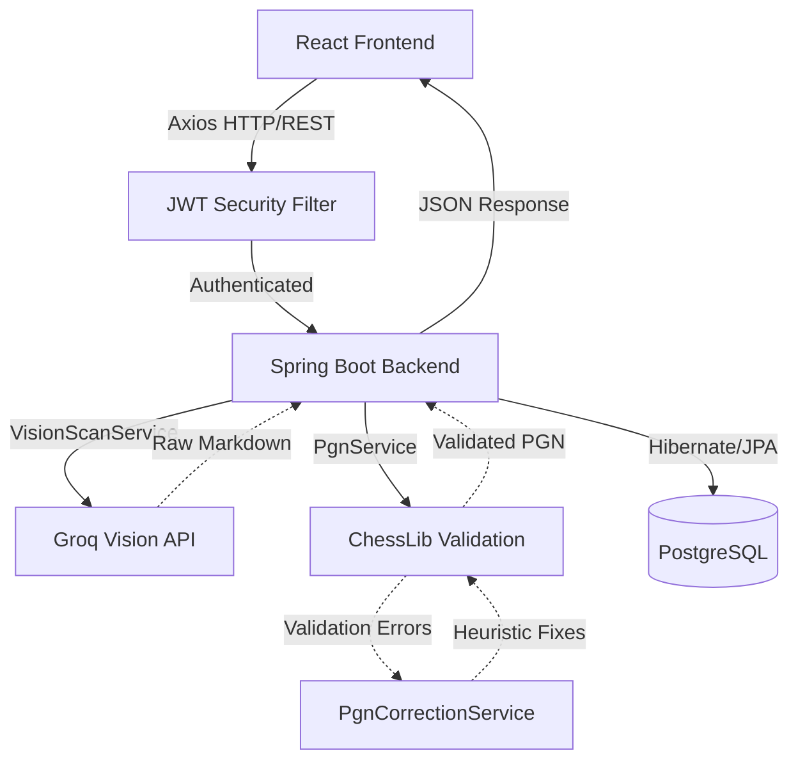
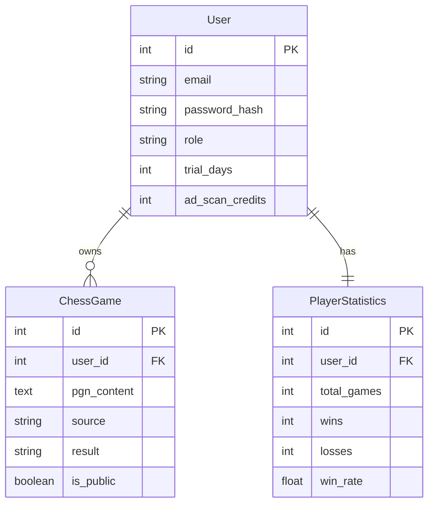
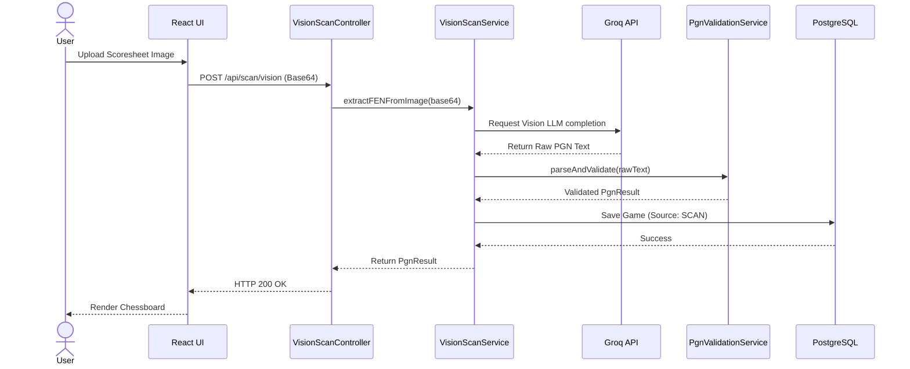
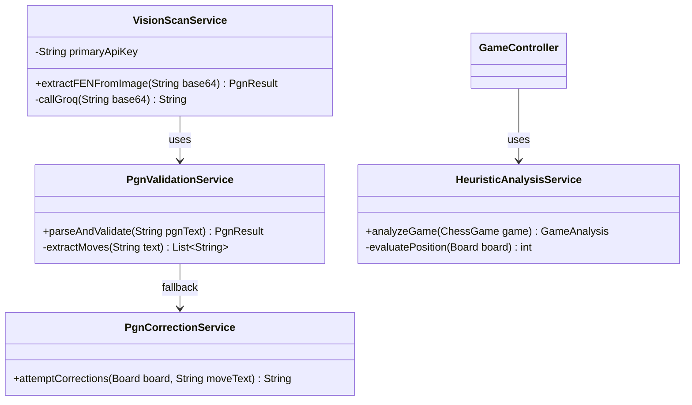

# System Architecture and Diagrams

## 1. Overall System Architecture
This diagram illustrates the end-to-end data flow from the React frontend, through the Spring Boot backend, out to the Groq Vision LLM, and back through the ChessLib validation engine.

## 2. Entity-Relationship (ER) Diagram
The core data model representing Users, their Games, and their aggregated Statistics.

## 3. Sequence Diagram: Image Scan Flow
This sequence demonstrates the orchestration of a scan request, from the user upload to the final validated PGN result.

## 4. Class Diagram (Core Services)
Simplified representation of the core AI and validation service logic in the backend.

